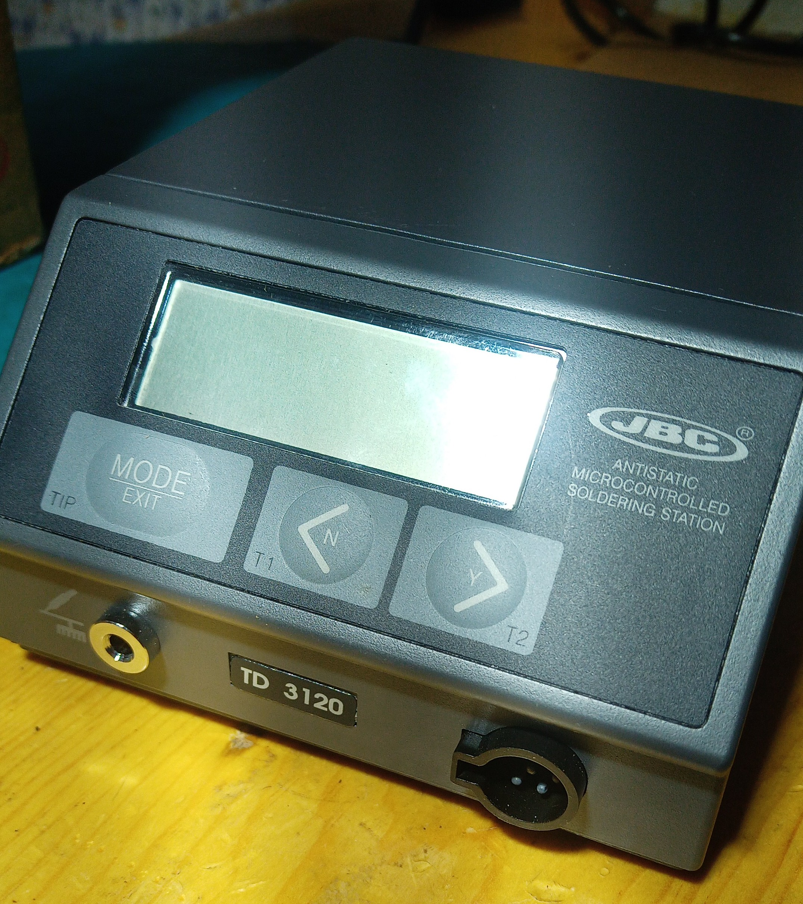
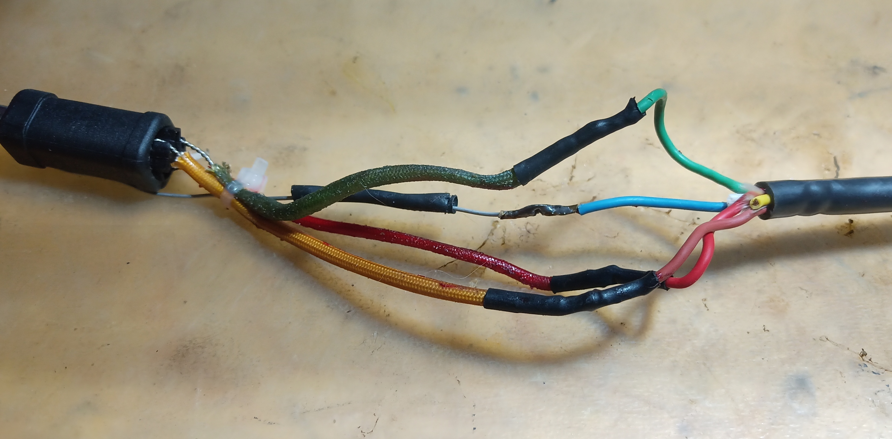
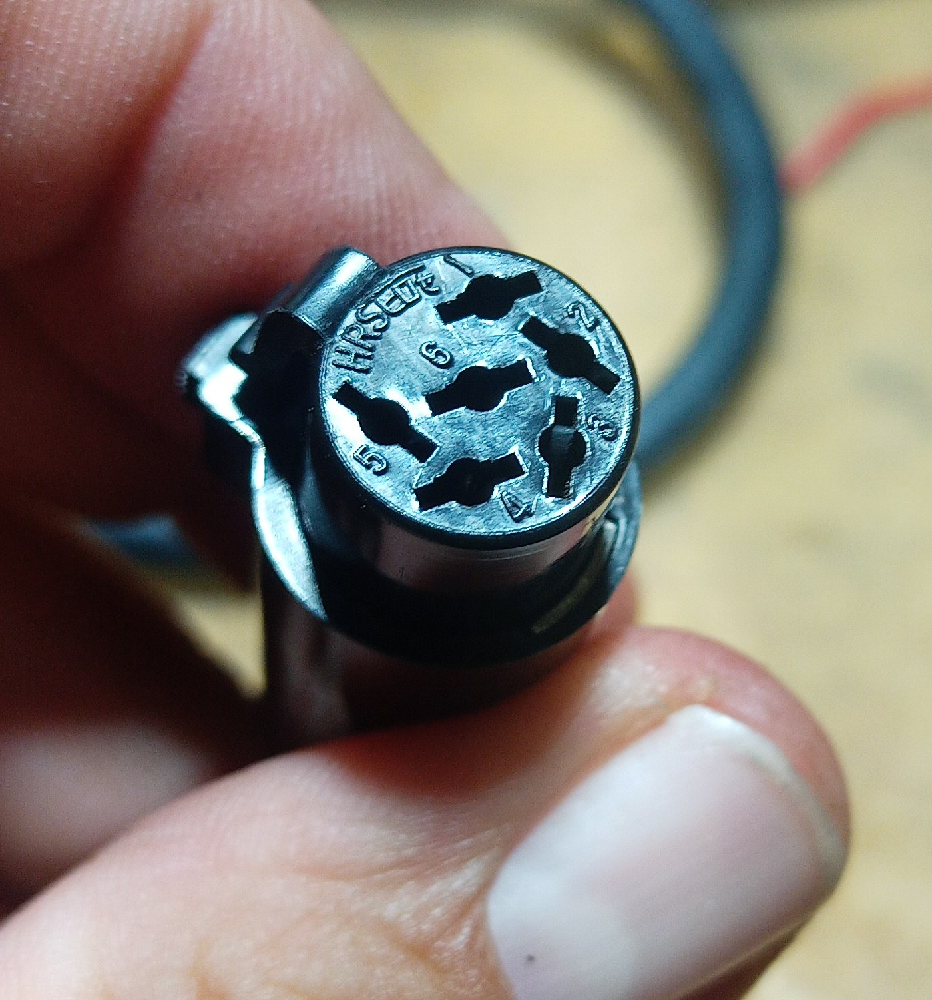
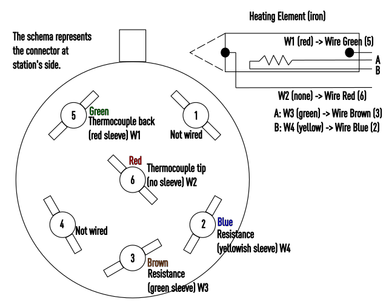
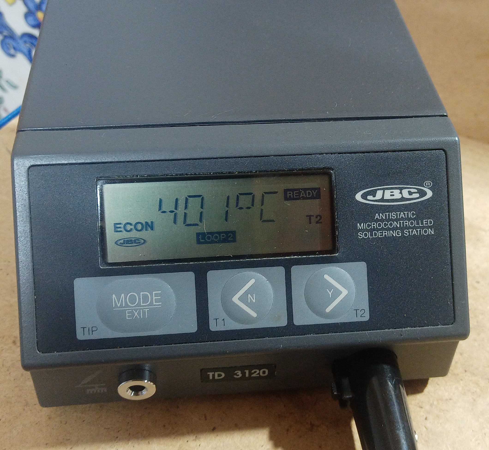
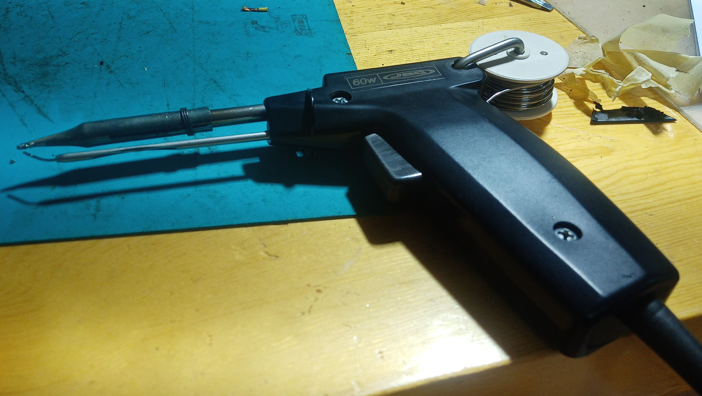

# JBC3120

</img>

How to fix the "err 3" in a JBC 3120 soldering station. I found a JBC 3120 soldering station in very good shape,
but it reports `err 3`: Looking the station manual, it reports _"There is no thermocouple reading. Possible causes: The soldering iron is not connected to the unit, thermocouple open or soldering iron cord broken"_ After inspecting the
wiring, I found this mess mounted in a stand alone iron:

</img>

So I do some reverse engineering on the cable and connector (image show the station's wire side)

</img>

And map the pin with the wires (iron side):

</img>

The heating element comes with some color sleeves in some wires. Note that the heating element have four wires, two for 
the thermocouple, one of the in the tip (no sleeve) and one in the back (red sleeve), and other two wires for the 
resistance (heater), with yellow sleeve,, and green sleve. The map is shown in the upper diagram.  A simple test to
power up, and here it is.

</img>

After that, I fix the tin feeder in the original gun again (60 W) and mount all together. Due the prior bad mounting, I 
have to iron the wires instead of use the provided clamps, but I manage to get everything working properly.

</img>

## Documentation

* [JBC Wiring Diagram](https://www.jbctools.com/pdf/electric_wire_diagram_TD3120.pdf) also <a href="doc/electric_wire_diagram_TD3120.pdf">From here</a>
* [JBC user Manual](https://www.jbctools.com/pdf/manual_TD3120_120v.pdf) also <a href="doc/manual_TD3120_120v.pdf">from here</a>